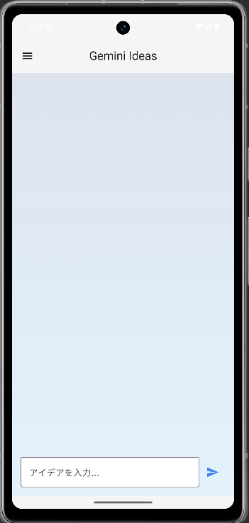
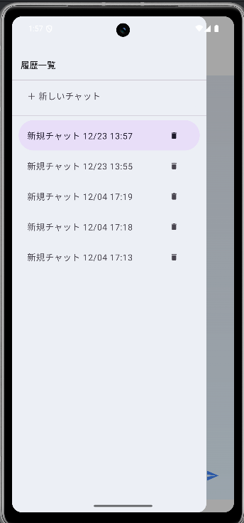

# 💡 Gemini Idea Generator (アイデア出し支援AIアプリ)

<p align="center">
  
  
</p>

## 📖 概要
Googleの生成AIモデル「Gemini 2.5 Flash」を活用した、Android向けアイデア出し支援アプリです．
単なるチャットボットではなく，「壁打ち相手」としてユーザーの発想を引き出すことに特化しています．

**「アイデアを出したいが，壁打ち相手がいない」「考えを整理したい」** という課題を解決するために開発しました．

## ✨ 主な機能
* **AIとの対話:** Gemini APIを用いたリアルタイムなアイデア生成．
* **履歴の自動保存:** アプリを閉じても過去のアイデアが消えない設計．
* **セッション管理:** サイドメニュー（Navigation Drawer）から，複数のチャットルームを切り替え可能．
* **安全性への配慮:** Google Safety Settingsに基づき，希死念慮やヘイトスピーチなどの有害コンテンツをフィルタリング．
* **ダークモード対応:** スマホの設定に合わせて，常に見やすいUIを提供。

## 🛠 使用技術 (Tech Stack)
* **開発言語:** Kotlin
* **UI:** Jetpack Compose (Material Design 3)
* **アーキテクチャ:** MVVM (Model-View-ViewModel)
* **データベース:** Room Database (SQLite)
* **AI API:** Google AI Client SDK for Android (Gemini 2.5 Flash)
* **非同期処理:** Coroutines / Flow
* **バージョン管理:** Git / GitHub

## 🧠 こだわりポイント（工夫した点）
### 1. アイデア出しへの最適化
汎用的な回答ではなく、ユーザーの思考を広げる「優秀なプランナー」として振る舞うよう，System Instruction（システムプロンプト）を調整しています．

### 2. 安全性の確保
ユーザーが精神的に不安定な状態で使用することも想定し，`HarmCategory.DANGEROUS_CONTENT` などのフィルタリング強度を調整．危険な入力に対しては適切な案内を返すようテストを行いました．

### 3. 今後の展望（ファインチューニング）
現在はプロンプトエンジニアリングによる制御ですが，今後は独自のデータセット（「入力」と「理想的な企画案」のペア）を作成し，Geminiのファインチューニングを行うことで，より精度の高い特化型モデルへのアップデートを予定しています．

## 🚀 セットアップ方法 (How to build)
このプロジェクトを実行するには，Gemini APIキーが必要です．

1. プロジェクトのルートディレクトリに `local.properties` ファイルを作成します．
2. 以下の行を追加し，ご自身のAPIキーを設定してください．
   ```properties
   geminiApiKey=YOUR_API_KEY_HERE

### 4. モダンなUI構築 (Jetpack Compose)
従来のXMLレイアウトを使用せず，**Jetpack Compose**による完全な宣言的UIで構築しました．

* **リアクティブな画面更新:** ViewModelが保持するデータを `StateFlow` で管理し，Compose側で `collectAsState` することで，チャットの送受信や履歴の読み込みをリアルタイムかつスムーズにUIへ反映させています．

* **Material Design 3 (M3) の採用:**
  最新のデザインガイドラインに準拠．`Scaffold` や `ModalNavigationDrawer` などのコンポーネントを活用し，ユーザーが直感的に操作できるUI/UXを実現しました．また，ライトモード/ダークモードの両方で視認性の高い配色設計（Color Scheme）を行っています．
